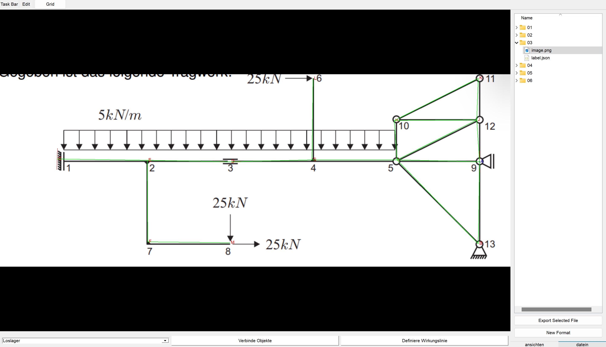
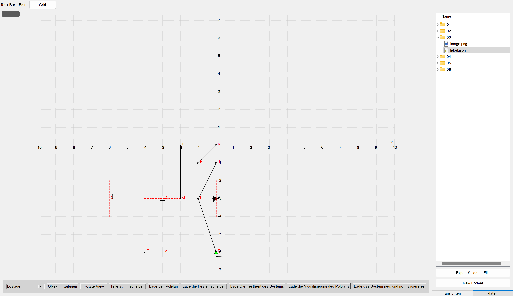
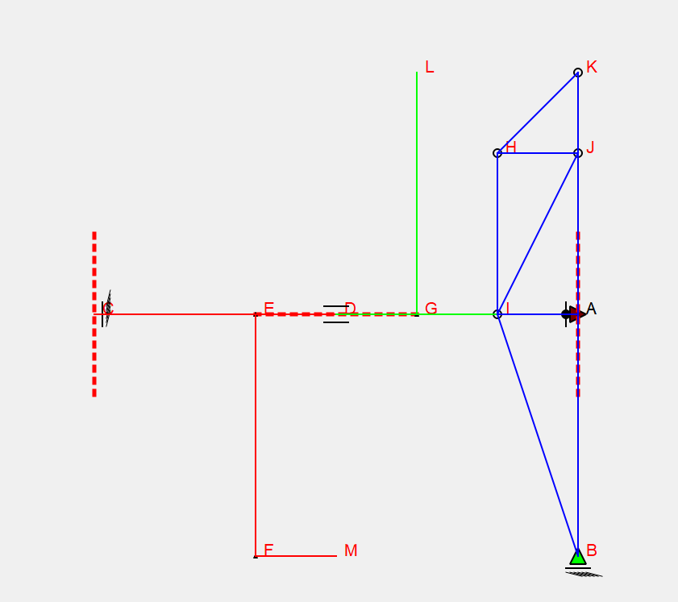
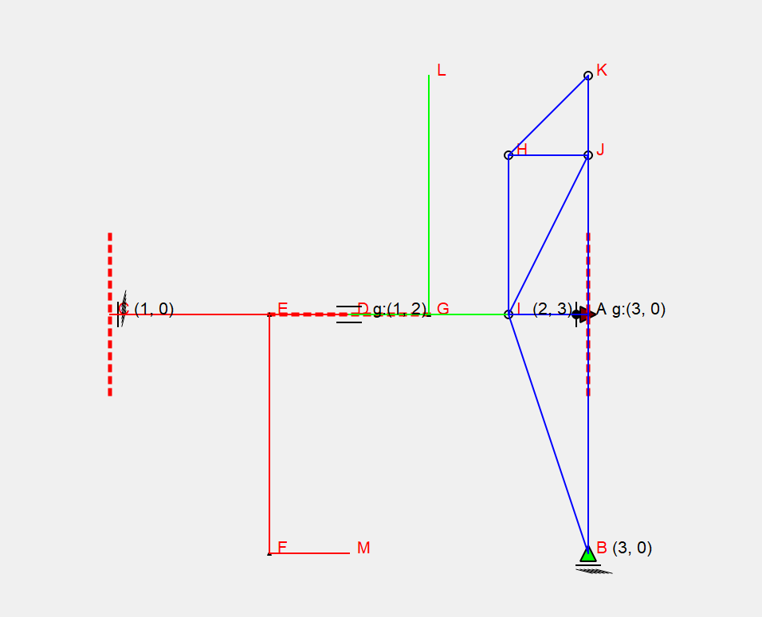
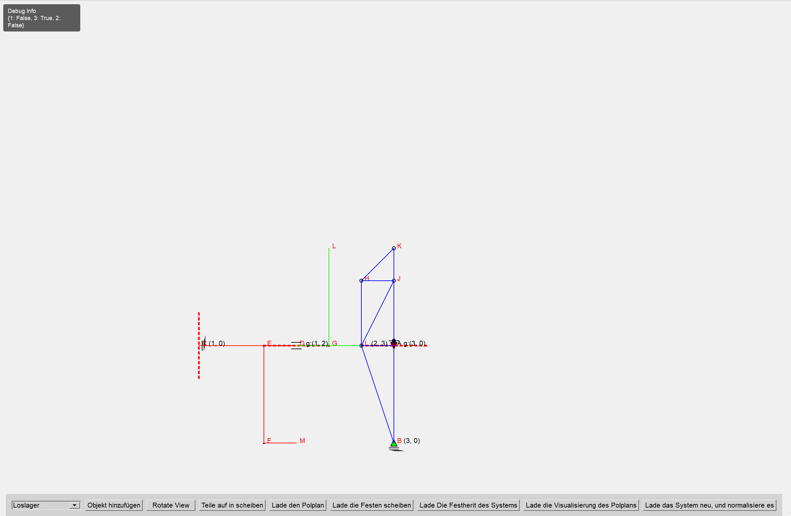

### StatikLabel

StatikLabel ist ein PyQt5 Program, dass es ermöglicht Label für statische Systeme zu erstellen und mit diesen zu arbeiten. 

Nach dem Installieren der requirements:
```
python main.py
```

#### Label Tab
Öffnet eine leere GUI, in die man in dem Explorermanager eine Label und Bild datei Laden kann: 



In diesem Tab ist es möglich nodes zu setzen, diesen type werte zu geben wie z.B Festlager etc. und diese dann mit staeben zu Verbinden. 

#### Normalized Tab
Dieses System kann man sich dann Normalisiert anzeigen lassen und bearbeiten:



In der Normalisiertung werden ähnliche längen in den verschiedenen axen gefunden und somit eine "perfektes" System erstellt, an dem es möglich ist die Berechnungen für einen Polplan zu machen.


#####  Polplan

###### Erkenunng und aufteilung in die Scheibe:


###### Beschriftung der Pole der einzelnen scheiben:


###### Erkennung welcher der Scheiben von sich aus fest sind:


###### Analyse des gesamten system
! noch nicht Implementiert !


